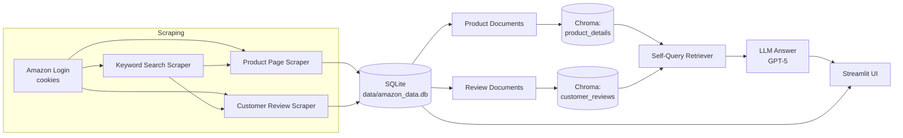

# 🛍️ Amazon Product & Review Intelligence

Scrape Amazon product listings and customer reviews, store them locally, and **ask natural-language questions** about them — answered by a Retrieval-Augmented Generation (RAG) pipeline with a Streamlit UI on top.

> Built as a hands-on project to go end-to-end: browser automation → structured storage → vector search → LLM-grounded answers.

---

## ✨ Features

- **Flexible scraping** — pull data from a single product URL, a bulk list of URLs (Excel upload), or a live Amazon keyword search.
- **Two data types, one flow** — product details (title, price, rating, description) and customer reviews (author, rating, date, review text) are scraped, stored, and indexed side by side.
- **Persistent storage** — everything lands in a local SQLite database (`data/amazon_data.db`), so re-running scrapes updates existing rows instead of duplicating them.
- **RAG over both collections** — products and reviews are embedded into separate Chroma vector stores, each queried with a **self-query retriever** so the LLM can translate a natural-language question into metadata filters (e.g. *"reviews rated below 3 stars"*, *"products under ₹500"*) automatically.
- **One-click reindexing** — a "Rebuild Index" button in the UI re-embeds new data without restarting the app.
- **Cookie-based auto-login** — reuses a saved Amazon session instead of scripting credentials, and skips CAPTCHA/2FA friction.

---

## 🏗️ Architecture



**Why two vector collections instead of one?** Products and reviews have different metadata shapes (price/rating/no_of_ratings vs. author/rating/date), so each gets its own self-query retriever tuned to its own filterable fields — better precision than one mixed collection.

---

## 🧰 Tech Stack

| Layer            | Tools |
|------------------|-------|
| Browser automation | Selenium, BeautifulSoup |
| Storage          | SQLite (via `pandas` + `sqlite3`) |
| Embeddings & Vector Store | OpenAI Embeddings, ChromaDB (`langchain-chroma`) |
| Retrieval        | LangChain Self-Query Retriever |
| LLM              | OpenAI GPT-5 (`langchain-openai`) |
| UI               | Streamlit |

---

## 📁 Project Structure

```
RAG/
├── app.py                       # Streamlit app — scraping UI + RAG chat UI
├── src/
│   ├── scrapers/
│   │   ├── login.py             # Selenium driver setup + cookie-based auto-login
│   │   ├── product_page.py      # Scrapes a single product detail page
│   │   ├── reviews.py           # Scrapes all reviews for a product (dynamic & paginated)
│   │   └── keyword_search.py    # Scrapes product listings for a search keyword
│   ├── storage/
│   │   └── database.py          # SQLite schema, save/load for products & reviews
│   └── rag/
│       └── pipeline.py          # Document loading, vector stores, retrievers, LLM answering
├── data/                        # amazon_data.db, amazon_cookies.pkl (git-ignored)
├── chroma_store/                # Persisted Chroma vector stores (git-ignored)
├── requirements.txt
└── .env                         # OPENAI_API_KEY (not committed)
```

---

## 🚀 Getting Started

### Prerequisites
- Python 3.10+
- Google Chrome installed (Selenium drives it directly)
- An OpenAI API key

### 1. Clone & install
```bash
git clone https://github.com/PankajSanger/RAG.git
cd RAG
python -m venv venv
venv\Scripts\activate        # Windows
pip install -r requirements.txt
```

### 2. Configure environment
Create a `.env` file in the project root:
```
OPENAI_API_KEY=your_key_here
```

### 3. Provide an Amazon session
Scraping relies on a logged-in session saved as browser cookies. Generate `amazon_cookies.pkl` once by logging into `amazon.in` in a Selenium-controlled Chrome session and pickling `driver.get_cookies()`. Place the file at `data/amazon_cookies.pkl` — `src/scrapers/login.py` loads it automatically on each run.

### 4. Run the app
```bash
streamlit run app.py
```

For a one-off query against an already-indexed collection without the UI:
```bash
python -m src.rag.pipeline
```
(Run it as a module with `-m` from the project root — a direct `python src/rag/pipeline.py` won't resolve its `src.*` imports.)

---

## 🖥️ Using the App

**Scrape Data mode**
1. Choose an input method — single URL, an uploaded Excel file of URLs, or a keyword search.
2. Pick what to scrape — product details, customer reviews, or both.
3. Click **Start Scraping** — results are saved to SQLite and downloadable as an Excel workbook.

**Ask About Products / Ask About Reviews mode**
1. Click **Rebuild Index** after scraping new data, to embed it into the corresponding Chroma collection.
2. Type a question in plain English — e.g. *"which hair oil has the best rating under ₹400?"* or *"what do customers complain about most?"*
3. The self-query retriever filters + semantically searches the relevant collection, and the LLM answers grounded only in the retrieved context.

---

## ⚠️ Notes

- This is a personal/educational project for learning end-to-end RAG systems — respect Amazon's Terms of Service and `robots.txt` before scraping any site at scale.
- `data/` (cookies + SQLite DB) and `chroma_store/` are git-ignored — they contain session/session-derived data and shouldn't be committed.
