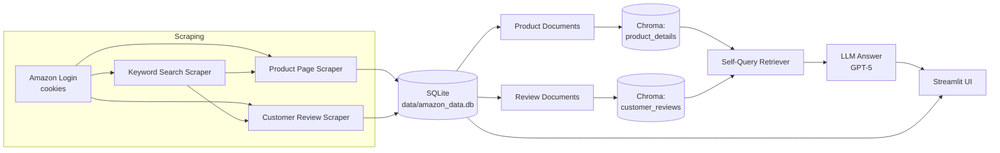

# 🛍️ Amazon Product & Review Intelligence

Scrape Amazon product listings and customer reviews, store them locally, and **ask natural-language questions** about them — answered by a Retrieval-Augmented Generation (RAG) pipeline with a Streamlit UI on top.

> Built as a hands-on project to go end-to-end: browser automation → structured storage → vector search → LLM-grounded answers.

---

## ✨ Features

- **Flexible scraping** — pull data from a single product URL, a bulk list of URLs (Excel upload), or a live Amazon keyword search.
- **Two data types, one flow** — product details (title, price, rating, description) and customer reviews (author, rating, date, review text) are scraped, stored, and indexed side by side.
- **Persistent storage** — everything lands in a local SQLite database (`data/amazon_data.db`), so re-running scrapes updates existing rows instead of duplicating them.
- **RAG over both collections** — products and reviews are embedded into separate Chroma vector stores, each queried with a **self-query retriever** so the LLM can translate a natural-language question into metadata filters (e.g. *"reviews rated below 3 stars"*, *"products under ₹500"*) automatically.
- **One-click reindexing** — a "Rebuild Index" button in the UI re-embeds new data without restarting the app.
- **Cookie-based auto-login** — reuses a saved Amazon session instead of scripting credentials, and skips CAPTCHA/2FA friction.

---

## 🏗️ Architecture



**Why two vector collections instead of one?** Products and reviews have different metadata shapes (price/rating/no_of_ratings vs. author/rating/date), so each gets its own self-query retriever tuned to its own filterable fields — better precision than one mixed collection.

---

## 🧰 Tech Stack

| Layer            | Tools |
|------------------|-------|
| Browser automation | Selenium, BeautifulSoup |
| Storage          | SQLite (via `pandas` + `sqlite3`) |
| Embeddings & Vector Store | OpenAI Embeddings, ChromaDB (`langchain-chroma`) |
| Retrieval        | LangChain Self-Query Retriever |
| LLM              | OpenAI GPT-5 (`langchain-openai`) |
| UI               | React (Vite + TypeScript + Tailwind), backed by a FastAPI API. Streamlit (`app.py`) remains available as a legacy local-only UI. |

---

## 📁 Project Structure

```
RAG/
├── app.py                       # Streamlit app — scraping UI + RAG chat UI
├── src/
│   ├── scrapers/
│   │   ├── login.py             # Selenium driver setup + cookie-based auto-login
│   │   ├── product_page.py      # Scrapes a single product detail page
│   │   ├── reviews.py           # Scrapes all reviews for a product (dynamic & paginated)
│   │   └── keyword_search.py    # Scrapes product listings for a search keyword
│   ├── storage/
│   │   └── database.py          # SQLite schema, save/load for products & reviews
│   └── rag/
│       └── pipeline.py          # Document loading, vector stores, retrievers, LLM answering
├── data/                        # amazon_data.db, amazon_cookies.pkl (git-ignored)
├── chroma_store/                # Persisted Chroma vector stores (git-ignored)
├── requirements.txt
└── .env                         # OPENAI_API_KEY (not committed)
```

---

## 🚀 Getting Started

### Prerequisites
- Python 3.10+
- Google Chrome installed (Selenium drives it directly)
- An OpenAI API key

### 1. Clone & install
```bash
git clone https://github.com/PankajSanger/RAG.git
cd RAG
python -m venv venv
venv\Scripts\activate        # Windows
pip install -r requirements.txt
```

### 2. Configure environment
Create a `.env` file in the project root:
```
OPENAI_API_KEY=your_key_here
```

### 3. Provide an Amazon session
Scraping relies on a logged-in session saved as browser cookies at `data/amazon_cookies.pkl`, which `src/scrapers/login.py` loads automatically on each run. Generate (or refresh, once it expires) that file with:
```bash
python -m src.scrapers.login
```
This opens a real, visible Chrome window — log into `amazon.in` by hand (this is the one step that can't be automated, since it may involve a CAPTCHA/2FA challenge) and the script detects the signed-in session and pickles the cookies to `data/amazon_cookies.pkl` for you. It needs a real display, so run it locally — not inside Docker (`SCRAPER_HEADLESS=1` makes it refuse to start).

`auto_login()` verifies the loaded cookies actually produced a signed-in session (checks the account nav for "Sign in") and raises `AutoLoginError` with a clear message — pointing at the command above — if not. Both the Streamlit app and the React/FastAPI scrape jobs surface this distinctly from a missing cookie file, so an expired session fails fast instead of silently scraping as a logged-out/guest session.

### 4. Run the app

**React frontend (primary UI)** — needs two processes:
```bash
# Terminal 1 — API (from the project root)
uvicorn src.api.main:app --reload --port 8000

# Terminal 2 — frontend
cd frontend
npm install
npm run dev
```
Then open the Vite dev server URL (default `http://localhost:5173`) — it proxies `/api` to the backend on port 8000. FastAPI's interactive docs are at `http://localhost:8000/docs`.

**Streamlit (legacy)**:
```bash
streamlit run app.py
```

For a one-off query against an already-indexed collection without either UI:
```bash
python -m src.rag.pipeline
```
(Run it as a module with `-m` from the project root — a direct `python src/rag/pipeline.py` won't resolve its `src.*` imports.)

---

## 🐳 Docker

A single container builds the React app and serves it, plus the `/api/*` routes, from one FastAPI process. Scraping runs **headless** inside the container (no visible browser window).

`guardrails-grhub-detect-pii` and `guardrails-grhub-toxic-language` aren't on public PyPI — they're served from Guardrails' private, token-gated index. The build needs that token to fetch them, passed in as a [BuildKit secret](https://docs.docker.com/build/building/secrets/) (never written into an image layer). Add to `.env`:
```
GUARDRAILS_TOKEN=<the token= line from ~/.guardrailsrc>
```
Then:
```bash
docker compose up --build
```
Open `http://localhost:8000`. `data/` and `chroma_store/` are bind-mounted, so the SQLite DB, Chroma vector store, and `data/amazon_cookies.pkl` are shared with your local setup — scrape via the local Streamlit/React flow or the containerized one interchangeably.

The app container's logs are capped (`max-size: 10m`, `max-file: 5` — see `docker-compose.yml`) so they can't silently fill the host's disk over time, and it restarts automatically (`restart: unless-stopped`) if it crashes or the host reboots.

### Backups
`scripts/backup.sh` tars `data/` + `chroma_store/` into a timestamped archive under `backups/`, keeping the last 7. It protects against application-level data loss (a bad reindex, accidental deletion) — **not** total instance/volume loss, since backups live on the same disk as the data. Run it manually, or on a deployed host, schedule it nightly via cron:
```bash
(crontab -l 2>/dev/null; echo "0 2 * * * $HOME/app/scripts/backup.sh >> $HOME/app/backups/backup.log 2>&1") | crontab -
```

---

## 🖥️ Using the App

**Scrape Data mode**
1. Choose an input method — single URL, an uploaded Excel file of URLs, or a keyword search.
2. Pick what to scrape — product details, customer reviews, or both.
3. Click **Start Scraping** — results are saved to SQLite and downloadable as an Excel workbook.

**Ask About Products / Ask About Reviews mode**
1. Click **Rebuild Index** after scraping new data, to embed it into the corresponding Chroma collection.
2. Type a question in plain English — e.g. *"which hair oil has the best rating under ₹400?"* or *"what do customers complain about most?"*
3. The self-query retriever filters + semantically searches the relevant collection, and the LLM answers grounded only in the retrieved context.

---

## ✅ Evaluation (deepeval)

The RAG pipeline is evaluated with [deepeval](https://github.com/confident-ai/deepeval) in `tests/test_rag_evaluation.py`, scoring both the product and review pipelines on **Answer Relevancy** and **Faithfulness** (LLM-judged, threshold 0.7) against real scraped data.

```bash
deepeval test run tests/test_rag_evaluation.py
```

Latest run (`temperature=0` on the LLM):

| Pipeline | Query | Answer Relevancy | Faithfulness |
|----------|-------|:-:|:-:|
| Product  | "Which hair oil is best for hair fall control?" | 1.00 | 1.00 |
| Product  | "Suggest a hair oil under 500 rupees with a good rating." | 1.00 | 1.00 |
| Review   | "What do customers say about the smell of the hair oil?" | 1.00 | 1.00 |
| Review   | "Are there any complaints about leakage or packaging?" | 1.00 | 1.00 |

**4/4 passed.** Note: with the default (non-zero) temperature, the leakage/packaging query was flaky — the retriever correctly surfaced the review mentioning "some leakage," but the LLM's summarization occasionally dropped or contradicted it, failing Faithfulness (0.67) on one run. Pinning `temperature=0` in `load_environment()` (`src/rag/pipeline.py`) resolved it.

Tests skip automatically if `OPENAI_API_KEY` is unset or if `data/amazon_data.db` has no scraped products/reviews yet.

---

## 🛡️ Guardrails

`src/rag/guardrails.py` wraps every pipeline answer with [Guardrails AI](https://github.com/guardrails-ai/guardrails) validators, applied in `_answer()` (`src/rag/pipeline.py`):

- **Input guard** — runs before retrieval. Blocks queries that are off-topic (unrelated to hair oil products/reviews) or attempt prompt injection/jailbreaking, via a custom LLM-judged `OnTopicGuard` validator, plus `ToxicLanguage` to reject toxic queries. Blocked queries get a fixed refusal message instead of reaching the LLM.
- **Output guard** — runs on the generated answer. `ToxicLanguage` strips toxic sentences from both pipelines' answers. `DetectPII` redacts PERSON/EMAIL/PHONE/etc. entities, but **only for `review_rag_pipeline`** — reviewer names are a real PII risk pulled in from scraped review text, whereas running it on `rag_pipeline` (products) caused false positives where brand/product names (e.g. "Indulekha Bringha") got misdetected as `PERSON` and redacted.

Setup (one-time):
```bash
guardrails configure --token YOUR_TOKEN   # free token from https://guardrailsai.com/hub/keys
guardrails hub install hub://guardrails/toxic_language
pip install guardrails-grhub-detect-pii   # installed directly via pip, not `hub install` -
                                           # its dependency chain hit a uv/cryptography file-lock
                                           # bug on Windows; the underlying package works fine
```
`ToxicLanguage` and `DetectPII` download models on first use (~an ALBERT model and spaCy's `en_core_web_lg`, respectively).

**Known implementation detail:** chaining multiple validators onto one `Guard` via repeated `.use()` calls silently dropped earlier validators' failures in this guardrails-ai version — each validator here gets its own single-validator `Guard`, run in sequence, to avoid that.

---

## ⚠️ Notes

- This is a personal/educational project for learning end-to-end RAG systems — respect Amazon's Terms of Service and `robots.txt` before scraping any site at scale.
- `data/` (cookies + SQLite DB) and `chroma_store/` are git-ignored — they contain session/session-derived data and shouldn't be committed.
